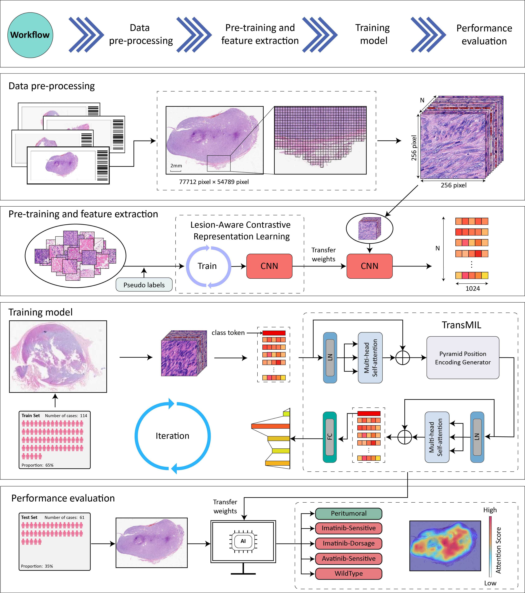

# Paper title: A deep learning model for predicting tyrosine kinase inhibitor response from histology in gastrointestinal stromal tumor.

## Authers:
### Xue Kong, Jun Shi, Dongdong Sun, Lanqing Cheng, Can Wu, Zhiguo Jiang, Yushan Zheng, Wei Wang, Haibo Wu.


Xue Kong, Jun Shi, Dongdong Sun contribute equally.

Haibo Wu, Wei Wang, and Yushan Zheng are the corresponding author.


### E-mail: 

- Haibo Wu: wuhaibo@ustc.edu.cn

- Wei Wang: weiwang@hmfl.ac.cn

- Yushan Zheng: yszheng@buaa.edu.cn
- 
## Abstract
<p style="text-align:justify; text-justify:inter-ideograph;">
     Over 90% of gastrointestinal stromal tumors (GISTs) harbor mutations in KIT or PDGFRA that can predict response to tyrosine kinase inhibitor (TKI) therapies, as recommended by NCCN guidelines. However, gene sequencing for mutation testing is expensive and time-consuming and is susceptible to a variety of pre-analytical factors. To overcome the challenges associated with genetic screening by sequencing, in the current study, we developed an artificial intelligence-based deep learning model that uses convolutional neural networks (CNN) to analyze digitized hematoxylin and eosin staining in tumor histological sections to predict potential response to imatinib or avapritinib treatment in GIST patients. Assessment with an independent testing set showed that our deep learning (DL) model could predict imatinib sensitivity with an area under the curve (AUC) of 0.902 in case-wise analysis and 0.807 in slide-wise analysis. Case-level AUCs for predicting imatinib dose-adjustment cases, avapritinib-sensitive cases, and wild-type GISTs were 0.920, 0.958, and 0.776, respectively, while slide-level AUCs for these respective groups were 0.714, 0.922, and 0.886. Our model showed comparable or better prediction of actual response to TKI than sequencing-based screening (accuracy 0.9286 versus 0.8929; DL model versus sequencing), while predictions of non-response to imatinib / avapritinib showed markedly higher accuracy than sequencing (0.7143 versus 0.4286). These results demonstrate the potential of a deep learning model to improve predictions of treatment response to TKI therapy from histology in GIST patients.
</p>
## Framework:


## Environment


## install 3rd library
```shell
pip install -r requirements.txt
```

## Feature format
```none
- feature_dir
  - slide-1_feature.pth
  - slide-2_feature.pth
  ......
  - slide-n_feature.pth
 xxx_feature.pth -> shape: number_patches, feaure_dim
```

## Training feature extractor (LACL)
### 1. Download [LACL](https://github.com/junl21/lacl)
### 2. Patch sampling
### 3. Training
```shell
python lacl_train.py
```

## Traning wsi classification model

## Citation
....